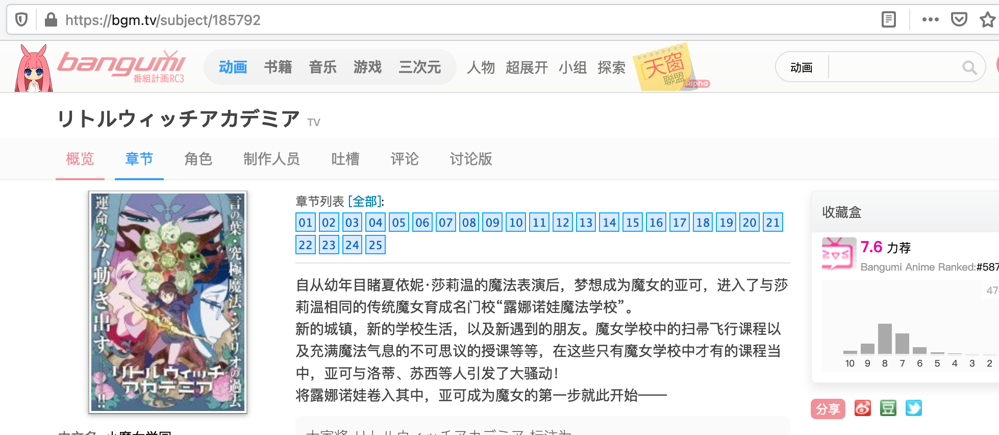

# dantalian

dantalian 是一个以 [bangumi](https://bangumi.tv/) 为数据源的动画作品的 NFO 文件生成器，
可以用于 [Jellyfin](https://jellyfin.org/)，[Kodi](https://kodi.tv/) 等媒体中心软件或播放器。

通常所用的刮削器例如，[The Movie DB](https://www.themoviedb.org)、[The TV DB](https://thetvdb.com/)，
采用将所有非 TV 剧集（OVA，总集篇，特别篇）不加区分放在 S00 中，这对 OVA 经常自成系列的日本动画并不友好，
特别体现在[《物语系列》](https://www.themoviedb.org/tv/46195/season/0)这样的动画中。AniDB 对其进行了区分，
但数据只有英文版本。

因此 dantalian 采用了 bangumi 作为源来生成 nfo 文件，在 Jellyfin, Kodi 这样的媒体中心软件中，
nfo 文件的优先级大于刮削器。不过媒体中心元数据库并非 bagnumi 的定位，因此部分数据有缺失。通常来说，
dantalian 生成的数据有以下特点：

* 每一季、每个系列的动画单独成条目，仅仅将属于某一季的特别篇列合并在当季里
* 偏向使用角色的信息而非演员的信息
* 支持文件夹名称中包含自定义标签
* 缺少分类和标签，缺少单集演员和staff名单。这部分将使用全剧的数据代替
* 缺少单集封面，将有媒体中心自行抓取

## 下载

参见 wiki 中的 [Download](https://github.com/nanozuki/dantalian/wiki/Download).

## 文件结构

### 源文件夹/Source Folder

Dantalian 遵循 Kodi 媒体文件的组织方式和 nfo 文件的 schema 及存放方式，分为媒体库的源文件夹和动画作品的文件夹。
源文件夹的详细说明请查阅 [Source folder](https://kodi.wiki/view/Source_folder)。

简单来说，源文件夹下放不同的动画作品的文件夹，作品文件夹下，放置全部的媒体文件，如下所示：

```
<源文件夹>/
├── ひぐらしのなく頃に 業
├── 化物語 [2009][BDRip]
├── [dantalian][202104][奇巧计程车ODD TAXI][01-13合集][BDRip][1080p]
├── 小魔女学园 [2017][TV]
└── 进击的巨人 最终季
```

* 即文件层级是 源文件夹 > 单一动画文件夹，不要再增加其他的文件夹层级
* 源文件夹下可以支持任意多的动画。
* 同一个源下，不要混合动画电影和TV动画，也不要放置其它媒体类型的文件

### TV动画文件夹/TV Anime Folder

TV 动画遵循 TV 剧集的处理方式，详情参见：
* [TV shows](https://kodi.wiki/view/Naming_video_files/TV_shows)
* [NFO files/TV shows](https://kodi.wiki/view/NFO_files/TV_shows)
* [NFO files/Episodes](https://kodi.wiki/view/NFO_files/Episodes)

```
源文件夹/
└── 化物語 [2009][BDRip]
    ├── dantalian.toml
    ├── tvshow.nfo
    ├── 化物語 01.chs.ass
    ├── 化物語 01.mp4
    ├── 化物語 01.nfo
    ├── 化物語 02.chs.ass
    ├── 化物語 02.mp4
    ├── 化物語 02.nfo
    ├── 化物語 SP5.5.chs.ass
    ├── 化物語 SP5.5.mp4
    └── 化物語 SP5.5.nfo
```

在每一个 TV 动画目录下，将会生成一个 tvshow.nfo 文件，以及伴随每一个 episode，会生成同名的以 nfo 为后缀的文件。
并且将会增加一个名为 dantalian.toml 的配置文件。

### 动画电影文件夹/Anime Movie Folder

尚未支持

## 文件夹设置

有三种方式设置动画文件夹

### 1. 自动匹配 bangumi 条目

目前 dantalian 支持非常有限的自动匹配。如果使用动画名在 bangumi 搜索，排名第一的结果能命中作品，就可以使用此方案，
可以使用命令 

```sh
dantalian bgm search <动画名>
```

来确认。可以使用中文名或者日文名。如果满足要求，将 TV 动画文件命名成如下的格式：

```
动画名 [tag1][tag2]
```

并将分集文件命名成如下格式：

```
[与文件夹相同的动画名] 12.mp4
```

如果为特别篇，在数字前加 `SP`。分集数字前可以加 0，也可以不加。

### 2. 手动指定 bangumi 条目

如果无法自动匹配，则需手动指定 bangumi 条目。在动画文件夹下，创建 dantalian.toml 文件，并填入 bangumi 的 subject id。
比如动画 2017 年 TV 版小魔女学园，在 bangumi 网站上搜索到的结果为：



注意到 URL subject/ 之后的数字 185792 即为 subject id。也可以使用 `dantalian bgm search 小魔女学园`， 可以同样确定 subject id 为 185792：

```
  * リトルウィッチアカデミア / 小魔女学园
    Subject ID: 185792
    Air Date: 2017-01-08
    URL: http://bgm.tv/subject/185792
```

于是，我们在小魔女学园文件夹下，创建 dantalian.toml 并填入：

```toml
subject_id = 185792
```

然后，分集文件采用与方法 1 中相同的方式命名：

```
小魔女学园 12.mp4
```

### 3. 手动指定分集文件的命名方式

如果不想对文件及文件夹进行重命名，可以在配置文件中通过正则表达式告知 dantalian 集数和类型的获取方式。例如我们示例文件夹中的 `./examples/source/[dantalian][202104][奇巧计程车ODD TAXI][01-13合集][BDRip][1080p]`，每一集的名字是

```sh
[dantalian][202104][奇巧计程车ODD TAXI][01][BDRip][1080p].mp4
[dantalian][202104][奇巧计程车ODD TAXI][02][BDRip][1080p].mp4
```

我们可以通过使用以下的配置来获取每个文件的集数（subject_id 必须填写）：

```toml
subject_id = 325285
episode_re = "^.*\\[(?P<ep>\\d\\d)\\].*\\.mp4$"
```

需要使用正则表达式的命名捕获功能，使用 "ep" 来捕获集数，使用 "sp" 来捕获是否为 SP。另外，前两种方式下，
dantalian 也会将默认使用的正则表达式写入配置文件，可供参考。比如之前的小魔女学园，在执行 dantalian 之后，
配置文件将变为如下内容：

```toml
subject_id = 185792
episode_re = "^(?P<name>リトルウィッチアカデミア|小魔女学园) (?P<sp>SP)?(?P<ep>[.\\d]+)\\."
```

## 生成 nfo 文件

在设置好源文件夹后，使用如下命令即可生成 nfo 文件：

```
dantalian --source <source folders>
```

可以一次指定多个源文件夹。

伴随文件的使用和播放，媒体中心软件可能修改 nfo 文件的内容存储动态数据，因此 dantalian 在检测到 nfo 文件后，
将跳过对应文件。如果想强制重新生成的话，可以添加选项 `--force <作品文件夹名>`，可以指定多个文件夹。

## Roadmap

- [ ] 动画电影/剧场版
- [ ] BD 文件
- [ ] DVD 文件
- [x] 自定义文件名或模糊匹配
